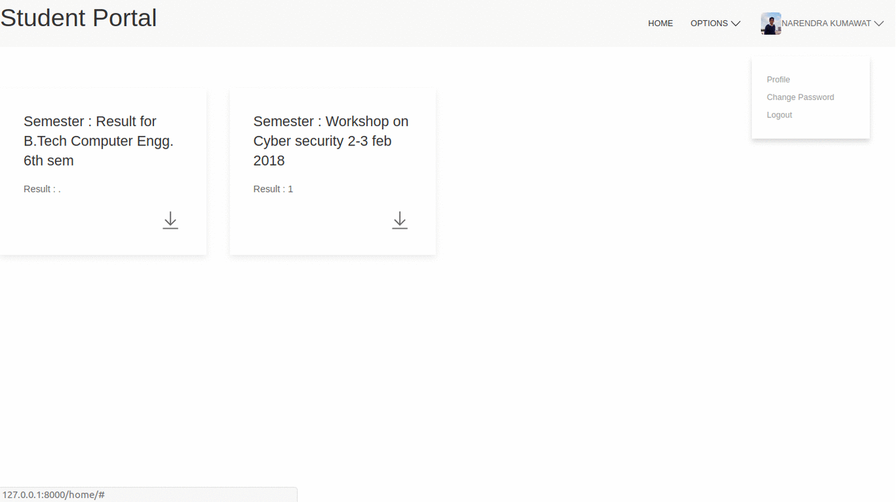

# Student-Portal
# Open Source Student Portal
#  Features!
  - Student login 
  - result
  - Notification
  - Fees pay
  - individiual chat ( not yet implimented)
### Tech
```
* Python
* Dijango
* UI-Kit 3 
* Sqlite3 
* Jquery 
```
### Installation
This requires Python Django to run.
Install the dependencies and devDependencies and start the server.
```sh
$ git clone https://github.com/nkkumawat/Student-Portal
$ cd Student-Portal
$ python manage.py runserver
```
Verify the deployment by navigating to your server address in your preferred browser.
```sh
127.0.0.1:8000/user/login
For Admin Access
127.0.0.1:8000/admin
```
